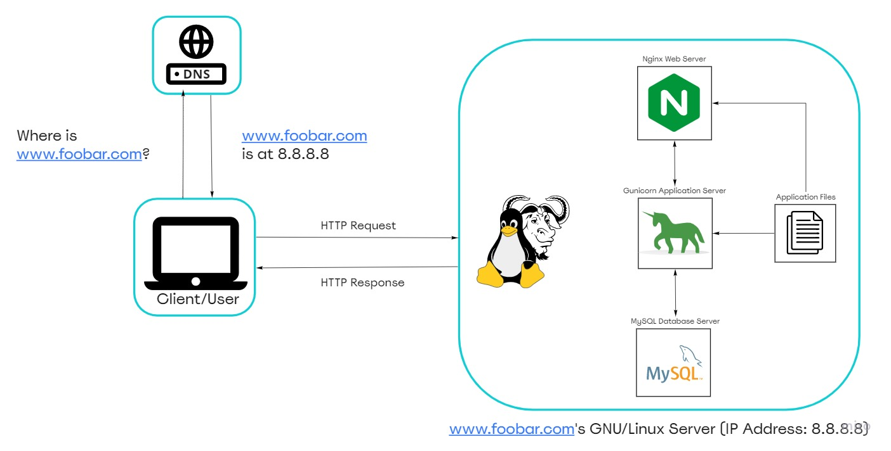

# Simple Web Stack

[Visit Board](https://miro.com/app/board/uXjVOfJwct0=/)

## Description

This is a simple web infrastructure that hosts a website that is reachable via `www.foobar.com`. There are no firewalls or SSL certificates for protecting the server's network. Each component (database, application server) has to share the resources (CPU, RAM, and SSD) provided by the server.

## Specifics About This Infrastructure

+ What a server is. A server is a computer hardware or software that provides services to other computers, which are usually referred to as *clients*.
 A server is generally located in a data center.
 A server can be physical or virtual.
 A server runs an Operating System. 

+ The role of the domain name. To provide a human-friendly alias for an IP Address. For example, the domain name `www.wikipedia.org` is easier to recognize and remember than `91.198.174.192`. The IP address and domain name alias is mapped in the Domain Name System (DNS)

+ The role of the DNS. The DNS's role is to traslate the record ofa domain name into an IP address. 

+ The type of DNS record `www` is in `www.foobar.com`. `www.foobar.com` uses an **A record**.
 `www.foobar.com` is an **A record** because it resolves to an IP addess.
 This can be checked by running `dig www.foobar.com`. **Note:** the results might be different but for the infrastructure in this design, an **A** record is used. 
<i>Address Mapping record (A Record)—also known as a DNS host record, stores a hostname and its corresponding IPv4 address.</i>

+ The role of the web server. The web server is a software/hardware that accepts requests via HTTP or secure HTTP (HTTPS) and responds with the content of the requested resource or an error messsage.
 A web server's role is to serve web pages (static content).

+ The role of the application server. To install, operate and host applications and associated services for end users, IT services and organizations and facilitates the hosting and delivery of high-end consumer or business applications
 An application server's role is to compute dynamic content.

+ The role of the database. To maintain a collection of organized information that can easily be accessed, managed and updated
 A database role is to store application data.

+ What the server uses to communicate with the client (computer of the user requesting the website). Communication between the client and the server occurs over the internet network through the (TCP/IP) protocol suite.

## Issues With This Infrastructure

+ This server is a SPOF (Single Point of Failure) because nothing is redundant.
+ There are multiple SPOF (Single Point Of Failure) in this infrastructure. For example, if the MySQL database server is down, the entire site would be down.
+ This website would be temporarily down when new code is deployed and the web server needs to be restarted.
+ Downtime when maintenance needed. When we need to run some maintenance checks on any component, they have to be put down or the server has to be turned off. Since there's only one server, the website would be experiencing a downtime.

+ This infrastructure Cannot scale if there's too much incoming traffic.
 It will not be able to handle traffic that exceeds the server capacity.
 It would be hard to scale this infrastructure becauses one server contains the required components. The server can quickly run out of resources or slow down when it starts receiving a lot of requests.
